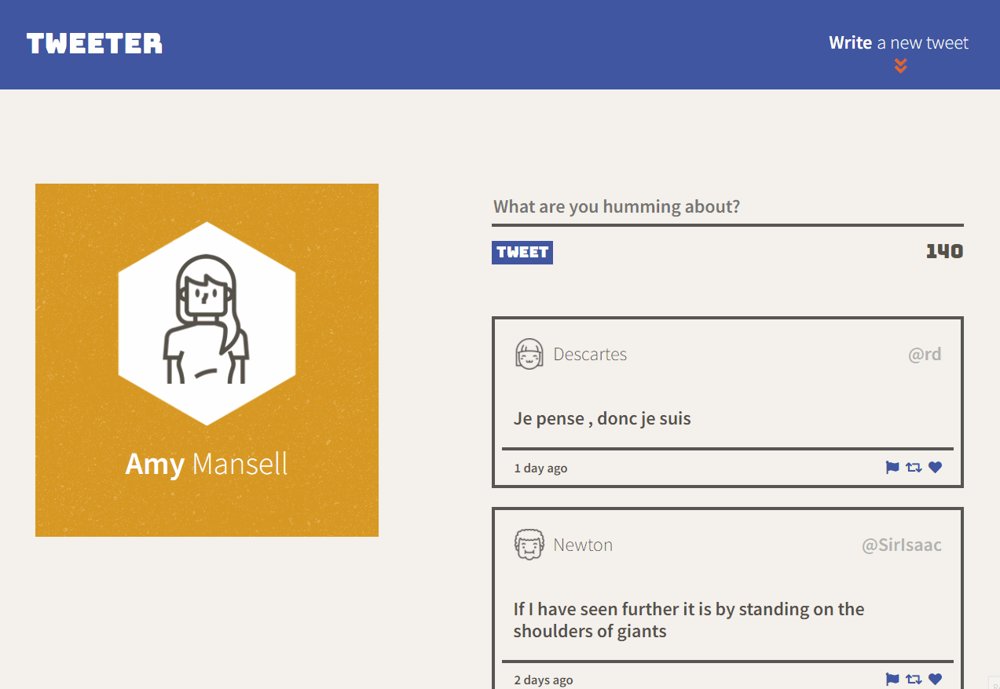
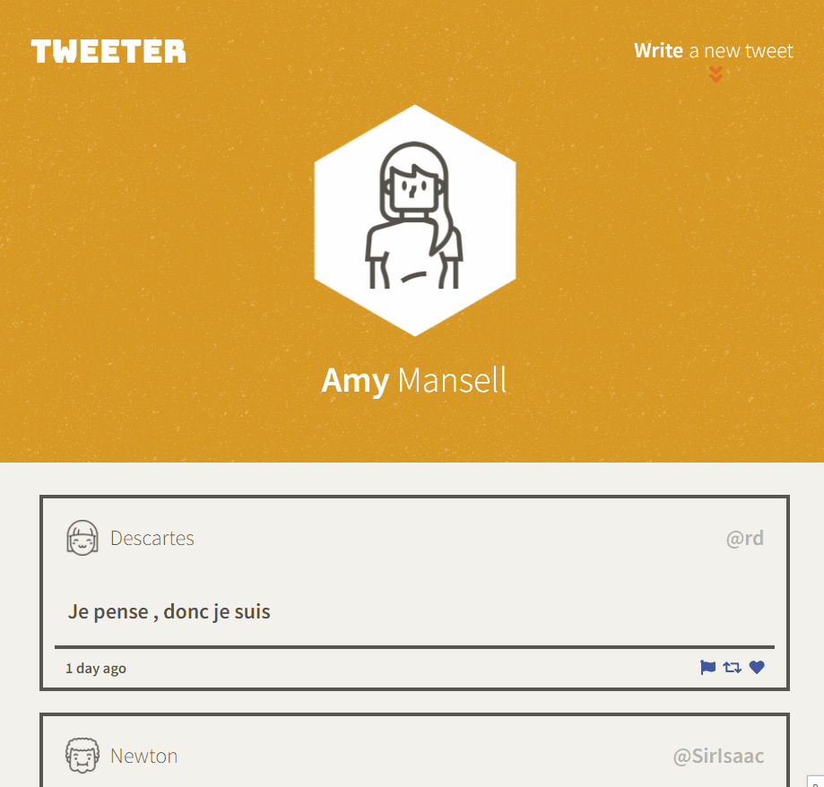

# Tweeter Project

Tweeter is a simple, single-page Twitter clone that supports tablet and desktop resolutions. This is part of Lighthouse  Lab's week four curriculum. 
The front-end is built off of HTML, CSS, JS, jQuery and AJAX, and the back-end is built on NodeJS and Express.

<h3 style="margin-top: 2em; font-style: italic; font-weight: bold">Windows View</h3>

<h3 style="margin-top: 1em; font-style: italic; font-weight: bold">Tablet View</h3>




## Features
- generates random names, pictures, and tweeter handles for each tweet
- dynamic text character counter
- supports desktops and tablets
- a toggle to return to the top of the screen


## Getting Started

- to install all dependencies
```
npm install
```

- to run the dev server
```
npm run local
```

- to access the server
```
http://localhost:8080/
```

## Dependencies

- Express
- Node 5.10.x or above
- bodyParser
- chance
- md5
